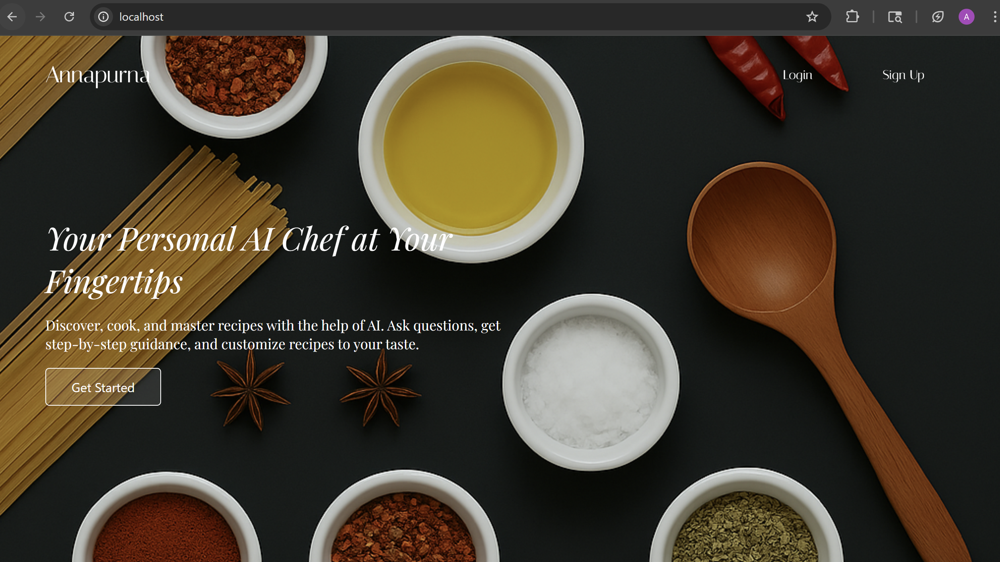
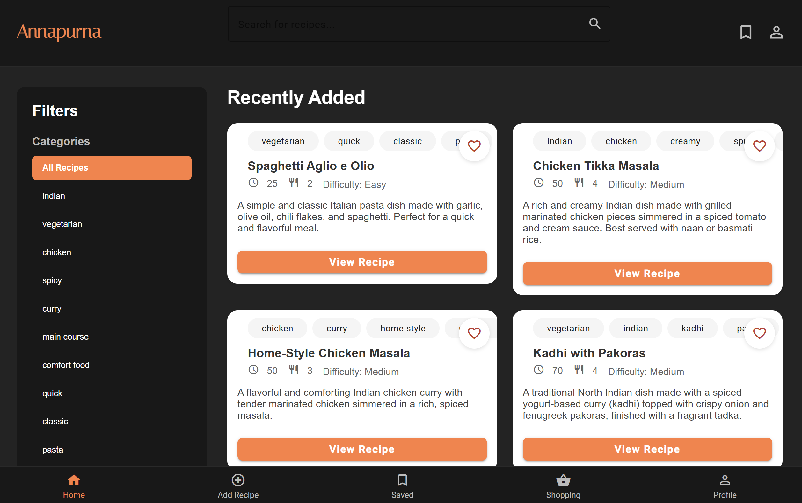
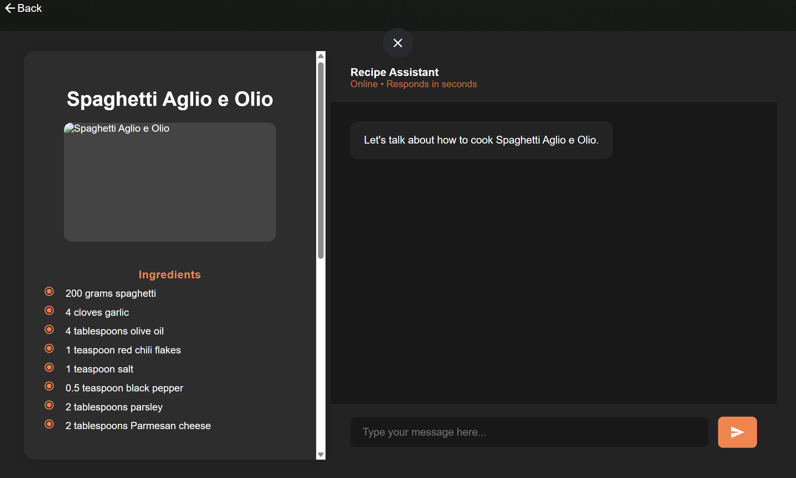

# Annapurna

Annapurna is a personal hobby project I took up after coming to the US and trying to learn how to cook. As a budding cook (with a CS degree) constricted by my budget, I faced 3 key problems:
1. **Ingredient Replacements**: It was often frustrating to constantly search for ingredient alternatives when I didn't have specific items on hand. 
2. **Hands-Free Cooking**: I struggled with needing to interact with devices (like rewinding a video or scrolling a recipe) while my hands are busy or messy. 
3. **Centralized Recipe Hub**: Recipes that I found are scattered across various platforms, often hidden behind ads and presented in inconsistent formats.

> ### _Therefore the solution was this project._

In this feature rich project, I built a website that allows you to search for any particular recipes that you would like to try, have a hands-free conversation about the recipe while you cook and ask for adjustments on the go. 

### Key Features
Annapurna is designed to be your all-in-one kitchen companion, offering a variety of functionalities to enhance your cooking experience:

 - Recipe Search & Filtering: Easily find recipes by searching for specific dishes or filtering by cuisine, difficulty level, and cooking time.
 - Interactive Cooking Assistant:
   - Text Chat: Chat with an intelligent agent to get real-time guidance and adjustments for your chosen recipe.
   - Voice Agent: Switch to a voice-guided assistant that walks you through ingredients and steps, allowing for a completely hands-free cooking experience.
 - Personalized Recommendations: The landing page suggests new recipes for you to explore and recommends dishes based on your liked and previously made recipes.
 - Recipe Management:
   - Save Favorites: Bookmark your favorite recipes for quick access later.
   - Add Your Own Recipes: Easily input your recipes, including ingredients, steps, cooking time, and images.
   - Smart Recipe Parsing: Paste recipe text from external sources, and Annapurna will automatically parse and store the information for you.
 - Shopping List: Keep track of items you need for your next grocery run by adding them to a dedicated shopping list within the application.

## Tech Stack

### Backend
- **Framework**: FastAPI (Python)
- **Database**: MongoDB with Beanie ODM
- **AI Integration**: OpenAI API
- **Vector Database**: ChromaDB
- **Authentication**: JWT (JSON Web Tokens)
- **Other Dependencies**:
  - Uvicorn (ASGI server)
  - Python-dotenv (Environment management)
  - Pydantic (Data validation)

### Frontend
- **Framework**: Angular
- **Language**: TypeScript
- **Build Tool**: Angular CLI
